# ReleaseLens

ReleaseLens takes a Python packaging PEP and answers a single question: **is this specification actually implemented, where, and what does it mean for the codebase that depends on it?** It decomposes each PEP into atomic spec-claims, hunts for implementation evidence across `pip`, `uv`, and PyPI Warehouse, authors and self-critiques verification tests for the survivors, and renders a Markdown impact report against a target codebase resolved through a pluggable registry connector.

Under the hood it's a multi-agent pipeline orchestrated by LangGraph with a tiered evidence ladder (static grep → changelog archaeology → behavioural probe in a sandboxed venv), an evaluator-optimizer loop for test authoring with asymmetric model routing (Nova Pro author, Nova Lite critic), SQLite-checkpointed state with `resume`, end-to-end Langfuse tracing through three callback seams, deterministic cassette replay so CI never burns tokens, and a graded eval harness that emits feature/evidence F1 per PEP and pushes them back to Langfuse alongside the run trace.

> _**Where it is today:** PEP ingest, feature decomposition, the evidence ladder, test authoring/critique, eval scoring, and Markdown report rendering all run end-to-end against bundled PEPs. The registry-connector layer that resolves a **real target codebase** is still synthetic — `DevpiPublicConnector` returns canned `ResolvedTarget`s, so today's impact reports describe a stub package rather than your project. The evidence-tool calibration that drives F1 against ground truth is also still weak; the scoring is correct, the prompts and thresholds aren't tuned yet. See [Status](#status) for the line-by-line breakdown._

For the full system spec, see [`docs/architecture.md`](docs/architecture.md). For code-generation conventions, see [`AGENTS.md`](AGENTS.md).

```mermaid
flowchart TD
    %% ReleaseLens · LangGraph · ● Pro (gen) · ○ Lite (classify)

    START([START]):::se
    START ==>|"⚡ per PEP id"| PI1[pep_ingest]:::det
    START ==> PI2[pep_ingest]:::det
    PI1 & PI2 --> J1{{after_pep_ingest}}:::join

    J1 ==>|"⚡ per PEP id"| FE1("feature_extract ● Pro"):::pro
    J1 ==> FE2("feature_extract ● Pro"):::pro
    FE1 & FE2 --> J2{{after_feature_extract}}:::join

    subgraph LOOP ["evaluator–optimizer loop · budget = 2"]
        direction LR
        TA("test_author ● Pro"):::pro -->|differential test| CR("critic ○ Lite"):::lite
        CR -.->|"rubric feedback"| TA
    end

    J2 ==>|"⚡ per SpecClaim"| TA
    CR ==> T_OK([accepted]):::ok
    CR ==> T_EX([budget_exhausted]):::bad
    CR ==> T_UN([unverifiable]):::neu
    T_OK & T_EX & T_UN --> TAG[test_authoring_aggregate]:::det
    TAG --> J3{{after_test_authoring}}:::join

    subgraph LADDER ["evidence ladder · cost-gated · NOT a loop"]
        direction TB
        ES["① evidence_static · ripgrep + ○ Lite"]:::lite
        EC["② evidence_changelog · GitHub"]:::det
        EP["③ evidence_probe · uv sandbox · no LLM"]:::probe
        EA[evidence_aggregate]:::det

        ES ==>|"conf ≥ 0.8 ✓"| EA
        ES -.->|"conf &lt; 0.8 ↓"| EC
        EC ==>|"conf ≥ 0.8 ✓"| EA
        EC -.->|"conf &lt; 0.8 ↓"| EP
        EP --> EA
    end

    J3 ==>|"⚡ per (feature × tool)"| ES
    EA --> MB[matrix_build]:::det

    MB ==>|"⚡ per feature"| V1[verify]:::det
    MB ==> V2[verify]:::det
    V1 --> IS1("impact_scope ● Pro"):::pro
    V2 --> IS2("impact_scope ● Pro"):::pro
    IS1 & IS2 --> RR[report_render]:::det
    RR --> END_N([END]):::se

    subgraph SIDE ["cross-cutting · backgrounded"]
        direction LR
        TOOLS["tools · ripgrep · PyGithub · ChromaDB · uv · diff runner"]:::side
        OBS["Langfuse spans · nodes · LLM calls · tools"]:::side
        DUR["SqliteSaver · checkpoint &amp; resume"]:::side
    end
    END_N ~~~ SIDE

    classDef se    fill:#0f172a,stroke:#e2e8f0,color:#f8fafc
    classDef pro   fill:#1e1b4b,stroke:#818cf8,color:#e0e7ff
    classDef lite  fill:#0e4f5c,stroke:#22d3ee,color:#cffafe
    classDef det   fill:#14532d,stroke:#86efac,color:#dcfce7
    classDef probe fill:#7c2d12,stroke:#fdba74,color:#fed7aa
    classDef join  fill:#78350f,stroke:#fbbf24,color:#fef3c7
    classDef ok    fill:#166534,stroke:#4ade80,color:#f0fdf4
    classDef bad   fill:#7f1d1d,stroke:#f87171,color:#fef2f2
    classDef neu   fill:#1f2937,stroke:#9ca3af,color:#f3f4f6
    classDef side  fill:#fafafa,stroke:#d4d4d8,color:#71717a

    style LOOP   fill:#1e293b,stroke:#a5b4fc,color:#f1f5f9
    style LADDER fill:#1c1917,stroke:#fdba74,color:#fafaf9
    style SIDE   fill:#fafafa,stroke:#e4e4e7,color:#71717a
```



## Quickstart

```bash
make setup                       # uv sync --all-extras
uv run releaselens --help
uv run releaselens run --pep-ids 658
```

The `run` command end-to-ends the pipeline against a bundled PEP-658 fixture and writes a Markdown report under `reports/`. The path is printed on completion alongside the `run_id` (use it with `releaselens resume <run_id>` to replay from the SQLite checkpoint at `.releaselens/checkpoints.db`).

### Optional system dependencies

The pipeline runs end-to-end without any of these — each evidence node records a "skipped" / "no artefacts" note and the escalation ladder takes over — but you'll only see real source refs when they're present.

- **`ripgrep`** on `PATH` (used by `evidence_static`). Not a Python package, so it can't go in `pyproject.toml`. Install with the platform package manager:
  ```bash
  brew install ripgrep            # macOS
  apt-get install ripgrep         # Debian/Ubuntu
  ```
- **Local source clones** of the tools `evidence_static` should grep. Defaults are `data/sources/{pip,uv,warehouse}/`; override the parent dir with `RELEASELENS_SOURCES_DIR=/path/to/clones`.
  ```bash
  mkdir -p data/sources
  git clone --depth 1 https://github.com/pypa/pip data/sources/pip
  git clone --depth 1 https://github.com/astral-sh/uv data/sources/uv
  git clone --depth 1 https://github.com/pypi/warehouse data/sources/warehouse
  ```
- **`GITHUB_TOKEN`** in the environment (used by `evidence_changelog` for commit + release archaeology). Unauthenticated GitHub search is rate-limited to ~10 req/min and blocks the live run with cascading 403s; an authenticated token raises the limit to 30 req/min and is more than enough for the demo. A read-only personal access token suffices.
  ```bash
  export GITHUB_TOKEN=ghp_xxx
  ```
- **AWS credentials with Amazon Bedrock access** for any LLM mode other than `replay` or `stub` (i.e. `record-missing`, `record`, `live`). The pipeline calls Nova Pro and Nova Lite via Bedrock through LiteLLM, so the principal — IAM user, role, or SSO session — needs `bedrock:InvokeModel` on `amazon.nova-pro-v1:0` and `amazon.nova-lite-v1:0`, and **model access for both Nova models must be granted in the Bedrock console** (Bedrock → Model access → Manage model access; Nova model access is opt-in per account/region and is the most common reason a freshly-credentialed run still 403s). Default `replay` mode reads the bundled cassettes and needs none of this.
  ```bash
  export AWS_ACCESS_KEY_ID=...
  export AWS_SECRET_ACCESS_KEY=...
  export AWS_REGION=us-east-1            # or any region where Nova is available; AWS_PROFILE works too
  ```

---

## Status

The scaffold is complete: every node, every edge, every schema, and every reducer in `docs/architecture.md` §3–§7 exists in code and the graph executes end-to-end. What varies is whether each node does *real* work or returns deterministic stub data sized to the schema.

### Done

**Core graph.** All 12 nodes wired in `src/releaselens/graph.py`, all five `Send` fan-out points (PEP, feature, test-author per claim, evidence per tool, impact per feature), the evidence-escalation conditional ladder, and the SqliteSaver checkpointer.

**Schemas & state.** All 11 Pydantic v2 record types under `src/releaselens/schemas/`. `PipelineState` TypedDict with `add` / `dict_merge` reducers on every fan-in field.

**LLM nodes that do real work.**
- `pep_ingest` — reads RST from `data/peps/`, parses sections via `releaselens.peps.rst`.
- `feature_extract` — Nova Pro decomposition into atomic `Feature`s + `SpecClaim`s.
- `test_author` / `critic` — evaluator-optimizer loop with retry budget and feedback piping (ADR-0007), routed asymmetrically (Pro author, Lite critic).
- `evidence_static` — derives identifier-like search candidates from claim text, ripgreps the local source clone for each, sends top hits to Nova Lite for found / not_found / ambiguous classification with a confidence score; confidence ≥ threshold short-circuits the escalation ladder.
- `evidence_changelog` — commit and release archaeology via the GitHub wrapper, escalation rung two when static grep fails the confidence gate.
- `evidence_probe` — `uv venv`-sandboxed differential runner with three executors (`static_signature`, `behavioural_probe`, `metadata_assertion`), no LLM in the runner path; the rung-three confirmation step.

**Deterministic Python nodes (no LLM).** `evidence_aggregate`, `matrix_build`, `verify`, `impact_scope`, `report_render`.

**Eval harness.** `releaselens eval` loads YAML ground-truth fixtures from `data/fixtures/`, runs the graph end-to-end (replaying cassettes when present), and scores feature decomposition and evidence detection via pure-Python set arithmetic — TP/FP/FN with aggregate, per-tool, and per-method facets. Multi-run averaging via `--runs N` reports mean ± stdev; `feature_f1`, `evidence_f1`, and the per-tool / per-method breakdowns are pushed to Langfuse as scores per run, so eval traces are filterable in the UI alongside the corresponding pipeline traces.

**Tooling layer.** Real implementations with stub-mode parity selected via `RELEASELENS_<TOOL>_MODE`:
- `tools/ripgrep.py` — streaming stdout wrapper.
- `tools/github.py` — commit-archaeology via PyGithub.
- `tools/rag.py` — ChromaDB collections backed by Bedrock Titan embeddings.
- `tools/uv_sandbox.py` — per-invocation `uv venv` lifecycle.
- `tools/differential_runner.py` — three executors (`static_signature`, `behavioural_probe`, `metadata_assertion`); no LLM in the runner path.

**Bundled corpus.** Ten PEP RST documents under `data/peps/` (440, 503, 625, 639, 643, 658, 691, 700, 708, 740) — `make demo` runs the pipeline against 658, 691, and 740 end-to-end. PEP-658 has a graded ground-truth fixture in `data/fixtures/PEP-658.yaml` that drives the eval harness.

**LLM gateway & routing.** LiteLLM call wrapper with cassette record/replay (`src/releaselens/llm.py`); per-node model selection from `config/model_routing.yaml` (currently Amazon Nova family — see the file header for the rationale).

**Observability.** Langfuse self-host docker compose at `infra/langfuse/`; tracing wired through three seams (LiteLLM callback for generations, LangGraph `CallbackHandler` for node spans, `tool_span` context manager around each tool wrapper). All seams are no-ops without `LANGFUSE_*` env vars. See "See it in action" §5 for the walkthrough.

**CLI.** `releaselens run | resume | eval` with click; `run` auto-copies the bundled PEP fixture into `data/peps/` if missing.

**Tests.** Unit tests for the loop nodes, RST parser, smoke tests, integration scaffolding; recorded LiteLLM cassettes under `tests/cassettes/`.

### Not done

The gap between architecture-complete and "the numbers are publishable" is the [§19 done-state checklist](docs/architecture.md#19-done-state-checklist-for-the-implementer). The headline gaps:

- **Evidence-tool quality is the current bottleneck.** The escalation ladder is wired and the eval harness scores it correctly, but feature- and evidence-level F1 against the PEP-658 fixture are weak: the candidate-derivation prompts, ripgrep query shapes, and confidence thresholds all need tuning before the numbers are anything to point at. Scaffold is right; calibration is the work.
- **Eval ground-truth is one PEP deep.** Only `data/fixtures/PEP-658.yaml` is labelled. `--pep-ids 691,740` will run end-to-end but produce no eval scores — every other bundled PEP needs a hand-curated YAML fixture before it can be graded.
- **`DevpiPublicConnector` is synthetic.** Returns canned `ResolvedTarget`s with `pinned_version="0.0.0-stub"`; no HTTP traffic to a real devpi. The Protocol shape is correct; the network code isn't there.
- **No ADRs committed under `docs/adr/`** despite ADR-0001 through ADR-0007 being referenced throughout the spec.
- **No `docs/cost_model.md`** with per-stage figures from a baseline run.
- **`tests/integration/` is empty** — failure-mode coverage from architecture §12.3 not yet exercised.

---

## See it in action

### 1. End-to-end pipeline run

```bash
make setup
uv run releaselens run --pep-ids 658
```

What to look for:
- Console prints `run_id: <uuid>` and `report: reports/<run_id>/report.md`.
- The report has Spec / Reality / Impact sections per Feature. The Reality columns are populated by the live evidence ladder when ripgrep + local source clones + `GITHUB_TOKEN` are present (see "Optional system dependencies"); without them, evidence nodes record "skipped" / "no artefacts" notes and the columns show that the rung was unreachable rather than synthetic data.
- The Impact section will fall back to `version_first_seen=0.0.0-stub` because the registry connector (`DevpiPublicConnector`) is still synthetic — see "Not done."
- A SQLite checkpoint database appears at `.releaselens/checkpoints.db`.

### 2. Resume from a checkpoint

```bash
uv run releaselens resume <run_id>      # the run_id printed above
```

Confirms `SqliteSaver` is wired and the graph compiles against persisted state.

### 3. Test-author / critic loop

```bash
uv run pytest tests/unit/test_loop_integration.py -v
```

Drives the `test_author` → `critic` → `test_author` retry loop using recorded Nova cassettes from `tests/cassettes/`. To re-record against live Bedrock, delete the relevant cassette and re-run with AWS credentials present.

### 4. Tool wrappers in real mode

```bash
RELEASELENS_RIPGREP_MODE=real uv run python -c "from releaselens.tools.ripgrep import search; \
  [print(line) for line in search(['Feature'], ['src/releaselens/schemas'])]"

RELEASELENS_RAG_MODE=real uv run python -c "from releaselens.tools.rag import PEPCollection; \
  c = PEPCollection(); c.upsert('pep-658', 'metadata files via Warehouse'); print(c.query('metadata'))"
```

Stub mode (the default in tests) returns canned data registered per call key; unregistered keys raise `StubNotRegistered` so silent zero-result replays can't mask bugs.

### 5. Walkable trace via self-hosted Langfuse

Tracing is no-op until the three `LANGFUSE_*` env vars are set, so tests stay infra-free. To see a run end-to-end:

```bash
# 1. start Postgres + Langfuse via docker compose
make langfuse-up

# 2. open http://localhost:3000, create a local user + organisation +
#    project, then copy the project's public + secret keys into the env.
#    The Postgres volume persists across compose restarts, so this is a
#    one-time setup.
export LANGFUSE_HOST=http://localhost:3000
export LANGFUSE_PUBLIC_KEY=pk-lf-...
export LANGFUSE_SECRET_KEY=sk-lf-...

# 3. choose an LLM mode (see the table below) and run the pipeline.
#    Every node, every LLM call, every tool wrapper invocation is now
#    a span. record-missing is the recommended demo mode: one paid run
#    captures cassettes, every subsequent run replays them for free
#    while still emitting the trace.
RELEASELENS_LLM_MODE=record-missing \
  uv run releaselens run --pep-ids 658

# 4. refresh the Langfuse UI → Sessions, filter by the printed run_id.
#    LangGraph nodes appear as a trace tree; LLM generations under each
#    node carry input_tokens / output_tokens / cost_usd from LiteLLM;
#    test_author / critic spans carry the iteration attribute.
```

#### LLM modes (`RELEASELENS_LLM_MODE`)

| Mode | Behaviour | When to use |
|---|---|---|
| `replay` (default) | Refuses to call Bedrock; requires a cassette to exist for the exact prompt SHA, otherwise raises `CassetteMissing`. The `test_author` node converts that to a `budget_exhausted` terminal state per claim and the run completes with errors recorded in state. | Tests, deterministic CI. Will produce empty test-author / critic spans for any prompts that haven't been recorded — expected. |
| `record-missing` | Replay when a cassette exists; otherwise call Bedrock live and write the cassette. | Recommended for the trace demo: one run with AWS creds present captures every cassette, subsequent runs are free and identical. |
| `record` | Always call Bedrock live and overwrite the cassette. | Re-recording after a prompt change. |
| `live` | Always call Bedrock; never read or write cassettes. | Ad-hoc experimentation. |
| `stub` | Returns the canonical registered stub response per node. No Bedrock calls, no cassette I/O. | Smoke runs without AWS creds. Trace will show node spans but no real LLM generations. |

Default `replay` mode against a fresh PEP intentionally produces a noisy "trace full of `budget_exhausted`" — the cassettes under `tests/cassettes/` are sized to the unit tests, not to the real `pep_ingest` + `feature_extract` output, so prompt SHAs will not match. The graceful-degradation path is doing exactly what architecture §7.3.1 mandates; switch to `record-missing` once to capture the live cassettes.

[`docs/screenshots/langfuse-trace.png`](docs/screenshots/langfuse-trace.png, "Example Langfuse Trace")


`make langfuse-down` stops both containers; the named Postgres volume persists traces and your project keys between sessions, delete it explicitly (`docker volume rm releaselens-langfuse_langfuse_pg`) if you want a clean slate.

### 6. Lint and tests

```bash
make lint
make test
```

### 7. Eval

```bash
uv run releaselens eval                       # scores PEP-658 against data/fixtures/PEP-658.yaml
uv run releaselens eval --runs 5              # multi-run averaging: mean ± stdev per facet
```

What to expect right now: the harness runs end-to-end and surfaces feature/evidence F1 with per-tool and per-method breakdowns, but the numbers are weak — the evidence-tool prompts and confidence thresholds are the next chunk of work (see **Not done** above). Adding more graded PEPs is a matter of dropping additional `data/fixtures/PEP-XXX.yaml` files alongside the existing one; the runner picks them up automatically.

With Langfuse running, every eval run is tagged `eval=true` and emits `feature_f1`, `evidence_f1`, plus `per_tool_*_f1` and `per_method_*_f1` as scores against its run trace, so calibration changes are diffable in the UI.
