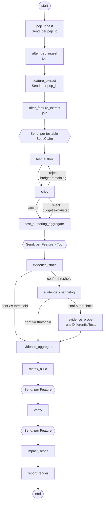

# ReleaseLens — Architecture

**Status:** v1 (poc demo scope)
**Owner:** Mark
**Audience:** the engineer implementing this. Read end-to-end before opening an editor.

---

## 1. What ReleaseLens does

ReleaseLens is a multi-agent pipeline that ingests Python packaging PEPs, reconciles them against real implementations across PyPI Warehouse, `pip`, and `uv`, and produces an impact report against a target codebase served by a pluggable artifact registry. The pipeline answers three questions per atomic feature:

1. **Spec.** What does the PEP say must be true?
2. **Reality.** Has each tool actually implemented it, when, and where is the evidence?
3. **Impact.** What would adopting it mean for *this* codebase — current behaviour, delta, effort?

The deliverable is a Markdown report. The temporal-gap analysis (PEP-finalised vs. earliest tool implementation) and the per-feature engineer-style scoping are the two outputs that distinguish ReleaseLens from a simple PEP-status tracker.

---

## 2. Demo scope (v1 boundary)

| Dimension | v1 |
|---|---|
| PEPs | 658, 691, 740 |
| Tools probed | PyPI Warehouse, `pip`, `uv` |
| Registry target | 1 × devpi public |
| Target codebases | Selected packages on the devpi instance |
| Output | Markdown report only |
| Persistence | SQLite checkpointer (LangGraph `SqliteSaver`) |
| Eval harness | Hand-labelled ground truth (no LLM-as-judge) |

Anything outside this table is v2 — see §16.

---

## 3. PipelineState

State is a `TypedDict` (not Pydantic). Pydantic models live *inside* state for the record types that need validation; the outer container is a plain TypedDict so LangGraph reducers compose cleanly.

```python
# src/releaselens/state.py
from typing import Annotated, TypedDict
from operator import add

from releaselens.schemas import (
    Feature, ImplementationEvidence, FeatureMatrix,
    VerificationResult, ImpactFinding, FeatureReport,
    DifferentialTest, TestCritique, TestAuthoringResult,
    PEPSource, TargetRef, ErrorRecord,
)


def dict_merge[K, V](a: dict[K, V] | None, b: dict[K, V] | None) -> dict[K, V]:
    """Shallow-merge reducer for dict fields with disjoint-key concurrent writes."""
    if a is None: return dict(b or {})
    if b is None: return dict(a)
    return {**a, **b}


class PipelineState(TypedDict, total=False):
    # ---- Inputs (set at graph invocation) ----
    run_id: str
    pep_ids: list[str]
    target: TargetRef
    confidence_threshold: float       # default 0.8, see §8
    test_retry_budget: int            # default 2, see §7.3 and ADR-0007
    test_acceptance_threshold: float  # default 0.75, see §7.3

    # ---- Stage outputs (filled progressively) ----
    pep_sources: Annotated[dict[str, PEPSource], dict_merge]   # by pep_id; per-pep_id Send shards
    features: Annotated[list[Feature], add]                    # fan-in from feature_extract
    differential_tests: Annotated[list[DifferentialTest], add] # fan-in from test_author
    test_critiques: Annotated[list[TestCritique], add]         # fan-in from critic
    test_authoring_results: Annotated[list[TestAuthoringResult], add]
    evidence: Annotated[list[ImplementationEvidence], add]     # fan-in from evidence_*
    matrices: Annotated[dict[str, FeatureMatrix], dict_merge]  # by pep_id
    verifications: Annotated[list[VerificationResult], add]
    impacts: Annotated[list[ImpactFinding], add]               # fan-in from impact_scope
    report: FeatureReport | None

    # ---- Observability ----
    errors: Annotated[list[ErrorRecord], add]
```

**Reducer rule:** every field that receives concurrent writes from `Send`-fanned nodes needs an explicit reducer. Lists use `Annotated[..., add]`. Dicts whose shards write disjoint keys (e.g. `pep_sources` and `matrices`, both keyed by `pep_id`) use the `dict_merge` reducer above — the LangGraph default replace-reducer would lose all but the last-arriving shard. Fields written by a single instance per run are plain. Get any of this wrong and concurrent writes silently overwrite each other.

---

## 4. Record schemas

All schemas are Pydantic v2 `BaseModel`s under `src/releaselens/schemas/`. Field types matter — they're how the verify and report nodes compose without hand-rolled glue.

### 4.1 `Feature` — an atomic capability

One PEP yields N Features. PEP 691 expands into separate Features for "JSON Simple Repository API endpoint", "content-type negotiation", "metadata exposure fields", etc. — *not* one Feature per PEP. See ADR-0008 (open) if this proves wrong in practice.

```python
class Feature(BaseModel):
    id: str                    # stable: "pep-691.json-simple-api"
    pep_id: str                # "PEP-691"
    title: str                 # "JSON Simple Repository API endpoint"
    description: str           # 1–3 sentences
    pep_status: Literal["Draft", "Accepted", "Final", "Withdrawn", "Rejected"]
    pep_finalised_on: date | None
    spec_claims: list[SpecClaim]
    introduced_version_claim: str | None   # what the PEP says, if anything
```

### 4.2 `SpecClaim` — a testable assertion lifted from the PEP

```python
class SpecClaim(BaseModel):
    id: str                    # "pep-691.json-simple-api.claim-01"
    feature_id: str
    claim_text: str            # quoted or paraphrased from the PEP
    claim_type: Literal["behavioural", "structural", "protocol", "metadata"]
    testable: bool             # if False, verification is descriptive only
    pep_section_ref: str       # e.g. "PEP-691#specification.endpoints"
```

### 4.3 `ImplementationEvidence` — one per (Feature × Tool × Method)

The pipeline produces multiple evidence records per (feature, tool) pair as it escalates through methods. Aggregation collapses them; raw records are retained for the report's appendix.

```python
class ImplementationEvidence(BaseModel):
    feature_id: str
    tool: Literal["warehouse", "pip", "uv"]
    method: Literal["static", "changelog", "probe"]
    found: bool
    version_first_seen: str | None       # SemVer/PEP 440 string
    confidence: float                    # 0.0–1.0, see §8
    source_refs: list[str]               # URLs, "git:sha:path:lines", etc.
    raw_excerpt: str | None              # ≤ 500 chars, for report citations
    notes: str | None
    collected_at: datetime
```

### 4.4 `FeatureMatrix` — per-PEP rollup across tools

```python
class FeatureMatrixRow(BaseModel):
    feature_id: str
    per_tool: dict[Literal["warehouse", "pip", "uv"], ImplementationEvidence]
    consensus_status: Literal[
        "implemented_everywhere",
        "partial",
        "missing",
        "inconsistent",     # found=True with conflicting versions/behaviour
    ]


class FeatureMatrix(BaseModel):
    pep_id: str
    rows: list[FeatureMatrixRow]
    generated_at: datetime
```

### 4.5 `VerificationResult` — claim ↔ evidence reconciliation

```python
class ClaimEvidenceLink(BaseModel):
    claim_id: str
    evidence_refs: list[str]             # ImplementationEvidence ids
    aligned: bool
    misalignment_note: str | None        # "uv 0.4.x exposes field X but as str, claim says int"


class VerificationResult(BaseModel):
    feature_id: str
    links: list[ClaimEvidenceLink]
    temporal_gap_days: int | None        # PEP-finalised → earliest tool implementation
    earliest_tool: Literal["warehouse", "pip", "uv"] | None
    notes: str | None
```

### 4.6 `ImpactFinding` — engineer-style scoping against the target

This is the load-bearing output. The node behaves like a senior engineer scoping a feature.

```python
class ImpactFinding(BaseModel):
    feature_id: str
    target: TargetRef
    current_behaviour: str               # may be "not_present"
    delta_description: str               # what would change
    affected_paths: list[str]            # file paths or "n/a"
    effort_estimate: Literal["XS", "S", "M", "L", "too_large_to_estimate"]
    risk_notes: str | None
    confidence: float                    # how sure are we about the scoping itself
```

**Cut-off rules** (see §7.5):
- Existing-behaviour scan times out → `current_behaviour = "not_present"` is acceptable.
- Delta exceeds size budget → `effort_estimate = "too_large_to_estimate"` is acceptable.
- Both are first-class outputs, not failures.

### 4.7 `FeatureReport` — the final artefact

```python
class FeatureReport(BaseModel):
    run_id: str
    pep_ids: list[str]
    target: TargetRef
    markdown_path: Path
    summary: ReportSummary               # counts, gap stats, top risks
    generated_at: datetime
```

### 4.8 Supporting types

```python
class PEPSource(BaseModel):
    pep_id: str
    rst_url: str
    fetched_at: datetime
    body: str                            # raw RST
    parsed_sections: dict[str, str]      # heading -> text


class TargetRef(BaseModel):
    connector: str                       # "devpi-public" only initially
    package: str
    version: str | None                  # None = latest


class ErrorRecord(BaseModel):
    node: str
    severity: Literal["warn", "error"]
    message: str
    timestamp: datetime
```

### 4.9 `DifferentialTest` — generated by `test_author`

A test produced by the test-author/critic loop (§7.3, ADR-0007) from a `SpecClaim`. Differential: produces a deterministic result that varies between a tool that implements the claim correctly and one that doesn't. Consumed by `evidence_probe` and the differential test runner (§9).

```python
class DifferentialTest(BaseModel):
    id: str                              # "pep-691.json-simple-api.claim-01.test-01"
    claim_id: str                        # the SpecClaim this tests
    test_kind: Literal[
        "static_signature",              # "tool exposes function with this signature"
        "behavioural_probe",             # "calling tool with X yields Y"
        "metadata_assertion",            # "registry response contains field Z"
    ]
    setup: str                           # human-readable preconditions
    invocation: str                      # exact command, request, or code to run
    expected: str                        # what a conformant implementation produces
    differentiator: str                  # what would distinguish a non-conformant impl
    iteration: int                       # 0 for first attempt; ++ on retry
    authored_by: Literal["test_author"]
```

### 4.10 `TestCritique` — produced by `critic`

The critic's evaluation of a `DifferentialTest`. Two scoring axes plus a single accept/reject decision. Feedback drives the next iteration if rejected.

```python
class TestCritique(BaseModel):
    id: str
    test_id: str
    coverage_score: float                # 0.0–1.0: how well does this test cover the claim
    determinism_score: float             # 0.0–1.0: how reliably does it produce a binary signal
    overall_score: float                 # weighted: 0.6*coverage + 0.4*determinism
    feedback: str                        # what to fix if score is low; empty if accepted
    accept: bool                         # overall_score >= test_acceptance_threshold
    iteration: int                       # mirrors DifferentialTest.iteration
```

### 4.11 `TestAuthoringResult` — terminal state of the loop

One per `SpecClaim`. The retry-budget loop produces exactly one of these per claim, regardless of how many iterations ran.

```python
class TestAuthoringResult(BaseModel):
    claim_id: str
    final_test: DifferentialTest | None  # None if status != "accepted"
    iterations_used: int                 # 1..(test_retry_budget + 1)
    status: Literal[
        "accepted",                       # critic accepted; final_test is set
        "budget_exhausted",               # critic rejected all iterations; flag in report
        "unverifiable",                   # claim.testable=False at source — never entered loop
    ]
    history: list[str]                   # critique ids, in order
```

`status="budget_exhausted"` is a first-class outcome — surfaced in the report's appendix as "spec claims we couldn't write a defensible test for." That signal is itself useful: it flags PEPs that are under-specified.

---

## 5. `RegistryTarget` Protocol

A `Protocol` (structural typing), not an ABC. The connector for the target codebase. Demo ships `DevpiPublicConnector`; `ThirdPartyConnector` is stubbed (raises `NotImplementedError` with a clear message).

```python
# src/releaselens/protocols/registry.py
from typing import Protocol, runtime_checkable, Iterable
from pathlib import Path

from releaselens.schemas import TargetRef


@runtime_checkable
class RegistryTarget(Protocol):
    """A registry-backed source of target codebases for impact analysis."""

    name: str

    def resolve(self, ref: TargetRef) -> "ResolvedTarget":
        """Pin ref to a concrete version and assert it exists. Raises TargetNotFound."""
        ...

    def fetch_source(self, resolved: "ResolvedTarget", dest: Path) -> Path:
        """Materialise the source tree. Returns the directory the tree was extracted into."""
        ...

    def fetch_metadata(self, resolved: "ResolvedTarget") -> dict:
        """Return registry-served metadata (for checking PEP 658-style sidecar metadata, etc.)."""
        ...

    def registry_capabilities(self) -> "RegistryCapabilities":
        """What does the *registry itself* expose? PEP 691 JSON API? PEP 658 metadata files?"""
        ...
```

```python
class ResolvedTarget(BaseModel):
    ref: TargetRef
    pinned_version: str
    artefact_url: str                    # the actual sdist/wheel URL


class RegistryCapabilities(BaseModel):
    serves_pep_691_json: bool
    serves_pep_658_metadata: bool
    serves_pep_740_attestations: bool
    notes: str | None
```

`registry_capabilities()` matters because for the three demo PEPs the registry itself is sometimes part of the implementation surface (PEP 691 is a server-side spec). The impact node consults this to disambiguate "the tool supports it" from "the registry serves it."

**Connector contract:** any class with these attributes satisfies `RegistryTarget`. No inheritance required. Register connectors via entry points in `pyproject.toml` so v2 plugins drop in.

---

## 6. Per-node model routing

**Driven by a YAML config.** LiteLLM is the gateway; nodes never name a model directly. Default: cheapest viable model per node, escalate by editing config. See §15 for the config file layout.

```yaml
# config/model_routing.yaml
defaults:
  temperature: 0.0
  max_tokens: 4000
  fallback_strategy: cross_family   # if Bedrock-Anthropic 429s, try Bedrock-Nova
  timeout_seconds: 60

nodes:
  pep_ingest:
    model: bedrock/anthropic.claude-haiku-4-5
    rationale: "Structural parsing of RST. No reasoning load."

  feature_extract:
    model: bedrock/anthropic.claude-sonnet-4-5
    max_tokens: 8000
    rationale: "Long PEP context + atomic-feature decomposition needs strong reasoning."

  test_author:
    model: bedrock/anthropic.claude-sonnet-4-5
    max_tokens: 4000
    rationale: "Generating differential tests from spec claims requires reasoning about what would actually distinguish a conformant from a non-conformant implementation. Sonnet on author, Haiku on critic — asymmetric on purpose; a cheaper critic forces clarity."

  critic:
    model: bedrock/anthropic.claude-haiku-4-5
    max_tokens: 1500
    rationale: "Score against rubric (coverage, determinism). Cheaper than the author it critiques — different model tier is the point. Evaluator-optimizer pattern."

  evidence_static:
    model: bedrock/anthropic.claude-haiku-4-5
    rationale: "Per (feature, tool) parallel — cost dominates. Code-shaped scan."

  evidence_changelog:
    model: bedrock/anthropic.claude-haiku-4-5
    rationale: "Pattern-match PEP refs in CHANGELOG.md. Cheap."

  evidence_probe:
    model: bedrock/anthropic.claude-haiku-4-5
    rationale: "Interpret structured probe output. Probe itself is deterministic."

  evidence_aggregate:
    model: none                        # deterministic, no LLM
    rationale: "Confidence math + version reconciliation. Pure Python."

  matrix_build:
    model: none
    rationale: "Deterministic rollup."

  verify:
    model: bedrock/anthropic.claude-sonnet-4-5
    rationale: "Claim↔evidence reconciliation needs careful reading of both."

  impact_scope:
    model: bedrock/anthropic.claude-sonnet-4-5
    max_tokens: 6000
    rationale: "Engineer-style scoping. The hard one. Escalate to Opus if Sonnet underperforms in eval."

  report_render:
    model: bedrock/anthropic.claude-haiku-4-5
    rationale: "Markdown templating from structured input."
```

**Loading:** `routing.py` exposes `get_model_for(node_name) -> LiteLLMConfig`. Each node calls this; never hardcodes. Swap models by editing YAML, restart the run.

**Pinning:** exact Bedrock model IDs (`anthropic.claude-sonnet-4-5-YYYYMMDD-v1:0`) live in `config/model_pins.yaml` and are referenced by the family aliases above. Reproducibility for eval runs depends on this — pin before benchmarking.

---

## 7. Graph topology

### 7.1 Diagram



**Join nodes between consecutive Send fan-outs.** LangGraph fires conditional edges *per Send shard*, not once on the merged state. Two consecutive fan-outs without a join between them re-fan N×N: e.g. `pep_ingest` → `feature_extract` (both per `pep_id`) would invoke `feature_extract` 9 times instead of 3. The diagram therefore inserts single-instance no-op join nodes (`after_pep_ingest`, `after_feature_extract`, `test_authoring_aggregate`) at every fan-out → fan-out boundary. The reducer rule in §3 only protects against silent overwrites in state; the join nodes protect against silent multiplicative re-execution in topology. Both are required.

### 7.2 Fan-out levels

| Stage | Fan-out | Rationale |
|---|---|---|
| `pep_ingest` | per `pep_id` (3) | Independent network fetches |
| `feature_extract` | per `pep_id` (3) | Independent reasoning per PEP |
| Test-author/critic loop | per testable `SpecClaim` | Each claim is independently authorable. ~3–5 testable claims per feature × ~5 features × 3 PEPs ≈ 50 parallel loops at peak. |
| Evidence pipeline | per `(feature, tool)` | True bottleneck; ~N×3 parallel branches where N = total features. Send API. |
| `impact_scope` | per `feature` | One scoping reasoning pass per atomic feature |

For ~5 features per PEP × 3 PEPs × 3 tools = ~45 parallel evidence pipelines at peak. LiteLLM concurrency limits and Bedrock TPS quotas are the real ceiling — set `max_concurrency=10` on the LangGraph compile call as a starting point and tune from Langfuse traces.

### 7.3 Conditional edges

Two distinct control-flow patterns. They are different on purpose.

#### 7.3.1 Test-author / critic loop (evaluator-optimizer with retry budget)

This is a **feedback loop** — author writes, critic scores, author revises until accepted or budget exhausted. ADR-0007.

```python
def after_critic(state: PerClaimState) -> str:
    crit = state["latest_critique"]
    if crit.accept:
        return "emit_test_authoring_result"   # status="accepted"
    if state["iterations_used"] >= state["test_retry_budget"]:
        return "emit_budget_exhausted"        # status="budget_exhausted"
    return "test_author"                      # loop with feedback
```

Defaults: `test_retry_budget = 2` (so up to 3 author attempts), `test_acceptance_threshold = 0.75`. Both in `config/thresholds.yaml`.

The critic's `feedback` field is fed back into the next `test_author` invocation as part of the prompt — the author *sees* what was wrong with iteration N when producing iteration N+1. Without this, the loop is a sham; this is what makes it an evaluator-optimizer rather than a sampling retry.

`SpecClaim.testable=False` claims skip the loop entirely and emit a `TestAuthoringResult` with `status="unverifiable"` directly. They show up in the report as descriptive-only verifications.

`test_authoring_aggregate` is the loop's terminal join. Both `accept` and `budget_exhausted` paths route here; it materialises exactly one `TestAuthoringResult` per claim (with the appropriate `status`) and serves as the single-instance barrier before the evidence fan-out. Keeping it as its own node — not folded into `critic` — matters because the budget-exhausted path otherwise has no clean terminator.

#### 7.3.2 Evidence escalation ladder (cost-gated short-circuit)

This is **not** a feedback loop — it's a cost ladder. Cheap method first; only escalate if confidence is too low to commit. The ladder stops when a method clears the threshold or when there are no more methods.

```python
def after_static(state: PerPairState) -> str:
    ev = state["latest_evidence"]
    if ev.confidence >= state["confidence_threshold"]:
        return "evidence_aggregate"
    return "evidence_changelog"


def after_changelog(state: PerPairState) -> str:
    ev = state["latest_evidence"]
    if ev.confidence >= state["confidence_threshold"]:
        return "evidence_aggregate"
    return "evidence_probe"


# evidence_probe is terminal — always proceeds to aggregate
```

`evidence_probe` consumes `DifferentialTest`s produced by §7.3.1 — when it runs, it picks tests for the current feature's claims, executes them via the differential test runner (§9), and interprets results. If a claim has `status="budget_exhausted"`, probe falls back to non-test evidence gathering for that claim and notes the gap.

**Stubs are first-class.** Each evidence method has a `STUBBED` mode that returns a deterministic synthetic `ImplementationEvidence` with `confidence=0.5` and `notes="STUB"`. Set per-method via env (`RELEASELENS_PROBE_MODE=stub`). Lets you ship the topology before wiring real probes.

### 7.4 Other conditional edges

- `feature_extract` → if `state["features"]` is empty for a PEP, log a warn into `errors` and skip its downstream branches. The graph still completes with a partial report.
- `verify` → unconditionally proceeds; missing evidence becomes a misalignment note, not a crash.
- `impact_scope` → if `target` is not resolvable (connector returns `TargetNotFound`), log error and emit one synthetic `ImpactFinding` per feature with `current_behaviour="target_unavailable"`. Report still renders.

### 7.5 Impact-scope cut-offs

`impact_scope` has two budgets enforced at the node level, not the LLM level:

1. **Existence-scan budget.** Up to ~30 seconds of static analysis (grep + light AST) on the resolved target. If nothing found → `current_behaviour="not_present"`, proceed. *Don't* keep digging.
2. **Delta-size threshold.** If the LLM returns a delta description >2k tokens or affected_paths >25, downgrade `effort_estimate` to `"too_large_to_estimate"` and trim `delta_description` to a 3-sentence summary.

Both behaviours are explicit goals, not failure modes. The senior-engineer-scoping framing depends on it: a real engineer says "this is a whole new piece of work, can't size it from here" when that's true.

---

## 8. Confidence model

Confidence is a `float ∈ [0.0, 1.0]` per `ImplementationEvidence`. Each method assigns its own:

| Method | High (≥0.8) | Medium (0.5–0.8) | Low (<0.5) |
|---|---|---|---|
| `static` | Exact symbol/path match + version tag aligns with PEP claim | Heuristic match (function name resembles spec term) | Nothing found |
| `changelog` | Explicit PEP number cited in entry | Feature-name match | Nothing found |
| `probe` | Observed behaviour matches/contradicts claim | Behaviour ambiguous | Probe failed to run |

**Threshold:** `confidence_threshold` defaults to 0.8. Below that, the per-pair pipeline escalates. At or above, it short-circuits.

**Probe is terminal.** Even if probe confidence is low, the pipeline doesn't escalate further — there's nowhere to go. Aggregate accepts whatever probe produced.

**Aggregate pick rule:** the highest-confidence evidence wins as the "primary" record for that `(feature, tool)`. Lower-confidence records are retained on the matrix row's appendix and surfaced in the report's evidence section.

---

## 9. Tool inventory

Tools used by nodes beyond LLMs. The pattern: each tool replaces an LLM call when the task is deterministic. LLMs reason; tools fetch and execute. Each entry below earns its place by being bound to a specific node and a specific job.

| Tool | Used by | Job |
|---|---|---|
| **`ripgrep`** | `evidence_static`, `impact_scope` | Fast structural search across source trees. Cheaper than passing whole repos to an LLM. The static evidence node greps for protocol terms / function signatures *before* sending hits to the LLM for semantic confirmation. The impact node uses it for the existing-behaviour scan inside the §7.5 budget. |
| **GitHub API** (PyGithub) | `evidence_changelog` | Commit archaeology: `git log --grep="PEP-691"`, release-tag enumeration, when-did-this-land queries. Returns structured data the LLM doesn't have to invent. Authenticated via `GITHUB_TOKEN` from Secrets Manager in production; from env locally. |
| **PEP corpus RAG** | `feature_extract`, `verify` | Local ChromaDB embedding store over the curated PEP set + their referenced PEPs. Lets `feature_extract` pull cross-references (PEP 691 references 503) without re-fetching them mid-prompt. Lets `verify` cite the exact spec passage when noting a misalignment. Embeddings: Bedrock Titan (cheap, in-region). |
| **Connector docs RAG** | `impact_scope` | Embeddings over the registry connector's docs + the target package's README/docs. Gives `impact_scope` grounded "what does this package currently do" context without dumping the whole repo into the prompt. Same Chroma store, separate collection. |
| **Differential test runner** | `evidence_probe` | Executes the `DifferentialTest`s produced by the test-author/critic loop. Three executors keyed on `test_kind`:<br>• `static_signature` → ripgrep + Python `importlib`/`inspect` resolution<br>• `behavioural_probe` → invokes `pip` / `uv` against a controlled fixture index in a `uv venv` sandbox<br>• `metadata_assertion` → HTTP GET against the registry, JSON path assertion<br>Returns structured pass/fail/error. **No LLM in this path** — that's the point. |
| **`uv venv` sandbox** | differential test runner (`behavioural_probe`) | Isolated, pinned-version venv per probe run. Tears down after each. Prevents cross-test contamination. `uv` chosen over `virtualenv` because it's one of the tools under test — using it as the sandbox runner is also a smoke test on the runner host. |
| **SQLite (LangGraph `SqliteSaver`)** | graph runtime | Already covered in §13. Listed here for completeness — it's the durable-state tool. |

**Determinism story.** The differential test runner is the source of hard pass/fail signals. Probe outputs are not LLM-judged; they're tool outputs the LLM only *interprets when assigning confidence*. That's the line between "LLM reasoning over deterministic ground truth" and "LLM-as-judge" — the former is fine, the latter is forbidden on the success path (ADR-0005).

---

## 10. Tracing & observability

Langfuse self-hosted is the tracer. **Why Langfuse over LangSmith:** self-hostable (the productionisation sketch in §12.4), no provider lock-in, OSS for the demo. LangSmith is fine but is Anthropic-adjacent SaaS; a self-hosted tracer is the better fit if the productionisation path lands on cloud-hosted infrastructure.

**Demo deployment:** Langfuse via `docker compose` locally — Postgres + Langfuse server, two containers. Production deployment in §12.4.

### 10.1 What the trace must show

The bar is **walkable**: an operator asks "what happened to PEP-691's JSON Simple API feature against `uv`?" and can drill from run → feature → (feature, uv) evidence pipeline → see static → changelog → probe escalation → see the `DifferentialTest` that probe used → see the `test_author` retry history that produced that test → see the critic's feedback at each iteration.

If any of those drill-downs is missing or unreadable, the trace has failed its job. Span structure is therefore part of the architecture, not an implementation detail.

### 10.2 Span hierarchy

```
run [run_id]
├── pep_ingest [pep_id]                          (3× parallel)
├── feature_extract [pep_id]                     (3× parallel)
├── test_author_loop [claim_id]                  (~50× parallel)
│   ├── test_author [iteration=0]
│   ├── critic [iteration=0]
│   ├── test_author [iteration=1]                (only if rejected)
│   ├── critic [iteration=1]                     (only if rejected)
│   └── test_author [iteration=2]                (only if rejected, last attempt)
│   └── critic [iteration=2]                     (only if rejected, last attempt)
├── evidence_pipeline [feature_id, tool]         (~45× parallel)
│   ├── evidence_static
│   ├── evidence_changelog                       (only if static low-conf)
│   └── evidence_probe                           (only if changelog low-conf)
│       └── differential_test_run [test_id]      (tool span, not LLM)
├── evidence_aggregate
├── matrix_build [pep_id]                        (3× parallel)
├── verify [feature_id]                          (~15× parallel)
├── impact_scope [feature_id]                    (~15× parallel)
└── report_render
```

### 10.3 Required span attributes

Set on every LLM-bearing span. The set of attributes is the contract between the runtime and the trace-walking experience — get any of them wrong and a drill-down breaks.

| Attribute | Notes |
|---|---|
| `run_id` | UUID, propagates to all children |
| `node` | name from §6 routing (e.g. `test_author`) |
| `model` | resolved Bedrock model ID (post-fallback) |
| `input_tokens` / `output_tokens` | from LiteLLM callback |
| `cost_usd` | from LiteLLM cost callback |
| `latency_ms` | wall-clock |
| `iteration` | for `test_author` / `critic` spans |
| `confidence` | for `evidence_*` spans |
| `feature_id` / `claim_id` / `tool` | for filtering & grouping |
| `target_ref` | for `impact_scope` |
| `fallback_used` | bool — did LiteLLM fall back to a different model |
| `stub_mode` | bool — was this a stubbed call (eval/dev only) |

### 10.4 Initialisation

`src/releaselens/observability/langfuse.py` wires Langfuse via the LiteLLM callback hook. Done once at CLI startup; nodes don't import Langfuse directly. This keeps observability swappable — the same nodes work against LangSmith with a config flip.

---

## 11. Evaluation harness

The eval harness produces deterministic, defensible numbers AND serves as a live demo artefact. ADR-0005 forbids LLM-as-judge on the success path; this section is how that constraint gets operationalised. The eval is itself part of the demo — see §11.5.

### 11.1 What gets scored

Two stages, two metric shapes. The decision to score these and not others is deliberate (see §11.7).

**Feature decomposition** — did `feature_extract` produce the right Features per PEP?
- Metrics: precision, recall, F1 over `Feature.id` matches.
- Match rule: a generated Feature matches a ground-truth Feature iff their `id` strings are equal. This is why stable IDs in §4.1 matter.
- Reported per-PEP and aggregated.

**Evidence detection** — for each (Feature, tool), did the pipeline correctly identify implementation status?
- Metrics: precision, recall, F1 over the `(feature_id, tool, found, version_first_seen)` tuple, using each pair's primary (highest-confidence) evidence record.
- Match rule: `found` matches exactly; `version_first_seen` matches exactly when both sides have `found=True`.
- Reported aggregate, per-tool, and per-method. Per-tool ("the pipeline does better on `pip` than `uv`") and per-method ("static is more reliable than probe") are the diagnostically interesting cuts.

### 11.2 Fixture format

One YAML file per PEP under `data/fixtures/PEP-XXX.yaml`. Pydantic-validated at load time — typos and schema drift fail fast with the offending field path.

```yaml
# data/fixtures/PEP-691.yaml
pep_id: PEP-691
pep_finalised_on: 2022-05-04
features:
  - id: pep-691.json-simple-api
    title: JSON Simple Repository API endpoint
    spec_claims:
      - id: pep-691.json-simple-api.claim-01
        claim_text: "Servers MUST expose the JSON-formatted endpoint at /simple/"
    expected_evidence:
      warehouse:
        found: true
        version_first_seen: "23.1"
      pip:
        found: true
        version_first_seen: "23.0.1"
      uv:
        found: true
        version_first_seen: "0.1.0"
  - id: pep-691.content-type-negotiation
    # ... and so on for each Feature
```

```python
# src/releaselens/eval/fixtures.py
class ExpectedEvidence(BaseModel):
    found: bool
    version_first_seen: str | None = None


class SpecClaimFixture(BaseModel):
    id: str
    claim_text: str


class FeatureFixture(BaseModel):
    id: str
    title: str
    spec_claims: list[SpecClaimFixture]
    expected_evidence: dict[Literal["warehouse", "pip", "uv"], ExpectedEvidence]


class PEPFixture(BaseModel):
    pep_id: str
    pep_finalised_on: date
    features: list[FeatureFixture]
```

### 11.3 Comparison procedure

Pure Python, < 100 lines. No LLM, no embedding similarity, no overlap heuristics. Set arithmetic for confusion matrices. Lives in `src/releaselens/eval/score.py`.

For feature decomposition:
- Generated set: `{f.id for f in state["features"] if f.pep_id == pep_id}`
- Expected set: `{f.id for f in fixture.features}`
- TP = intersection; FP = generated − expected; FN = expected − generated.
- Precision = TP / (TP+FP); recall = TP / (TP+FN); F1 = harmonic mean.

For evidence detection:
- Build the generated set by selecting primary evidence per `(feature_id, tool)` pair from `state["evidence"]` (highest-confidence wins per §8 aggregate rule).
- Build the expected set by enumerating each fixture's `expected_evidence` map.
- Same TP/FP/FN math, with three faceted views:
  - Aggregate: collapse over both `tool` and `method`.
  - Per-tool: group by `tool`.
  - Per-method: group by the `method` field of the primary evidence record (which method produced the winning evidence).

Prose fields (`claim_text`, `delta_description`, `current_behaviour`) are not scored. Surfaced as side-by-side exhibits in the eval report (§11.4 item 5).

### 11.4 Eval report

`releaselens eval` produces `reports/eval/<run_id>/eval.md`. Six sections, in order:

1. **Headline numbers.** Feature decomposition F1; evidence detection F1 (aggregate, per-tool, per-method). Three tables, no prose padding.
2. **Per-PEP breakdown.** Same metrics broken out per PEP. Quickly identifies "PEP-740 is where we're weak."
3. **Confusion matrices.** Evidence detection rendered as a (tool × method) grid for FP and FN counts. Visual: at a glance, where do mistakes cluster?
4. **Per-fixture pass/fail table.** One row per Feature. Each row shows expected vs. generated for both stages, with red/green markers. Allows drilling into a specific failure.
5. **Prose exhibits.** Side-by-side `claim_text` and `delta_description` for a sampled subset of features. Reader forms their own view; the eval doesn't pretend to score them.
6. **Run metadata.** Models used, fallbacks triggered, total cost, run duration, Langfuse trace URL.

Eval traces are tagged `eval=true` in Langfuse — filterable, walkable side-by-side with the eval report.

### 11.5 The demo flow

How best to review and understand the demo:

1. **Show the fixtures.** Open `data/fixtures/PEP-691.yaml`. They're committed, readable, diffable. "This is what a senior Python engineer says is correct for PEP 691."
2. **Run eval.** `releaselens eval`. Streams Langfuse trace URL on start; ~4–5 minutes for the demo scope.
3. **Walk the eval report.** Open the rendered `eval.md`. Top-level numbers, then drill into a per-fixture row that *failed*. Failures are where the trace's diagnostic value shows up.
4. **Walk the trace.** From the failed row, jump to the Langfuse trace for that feature. Walk through `evidence_static → evidence_changelog → evidence_probe` to *see why it got the wrong answer*. The trace explains the failure.

Step 4 is where the eval's diagnostic value shows up: a failed metric points at a specific feature, and the trace for that feature shows which stage produced the wrong answer and why. Without the eval, the pipeline produces output without a way to interrogate it.

### 11.6 Variance and reproducibility

Single-run is the default. All nodes pin `temperature=0.0` (already set in routing config). Bedrock is roughly deterministic at temperature 0 but not bit-exact — `version_first_seen` strings can differ across runs in rare cases, and feature decomposition can occasionally miss/add a borderline feature.

`--runs=N` flag (default 1) for multi-run averaging:
- Runs N independent invocations against the same fixtures (independent `run_id`s; checkpointer scoped per-run).
- Reports mean and stdev for each metric.
- Reported numbers in summary docs use `--runs=3`. Interactive runs use the default for speed.

Reported numbers are mean of 3 runs; the default command runs once. ±2% variance is typical.

### 11.7 What's NOT in v1

Documented so it doesn't get dragged in:
- **CI integration / regression gates.** Out of scope; the eval produces numbers, not policy. v2 wraps this in CI.
- **Calibration data for v2 LLM-as-judge.** The hand-labelled fixtures are *the* future calibration set, but v1 doesn't anticipate that — fixture fields are scoped to v1's needs only. Restructure when v2 lands.
- **Ground-truth labels for prose fields.** Not scored, not labelled. Exhibits only.
- **Eval over `temporal_gap_days`, effort estimates, or test-authoring quality.** All three deferred:
  - Temporal gap accuracy: defer until temporal-gap analysis is itself the headline output.
  - Effort estimates: inherently subjective; scoring with hand labels just buries the subjectivity in the labels.
  - Test-authoring quality: would require a separate ground truth of "well-formed differential tests," which is itself a meta-eval problem.

---

## 12. Production-grade considerations

The deliverable is a CLI; the conversation around it is production-shaped.

### 11.1 Cost

Per-run token budget for v1 demo scope (3 PEPs, ~5 features each, ~3 testable claims per feature, 1 target):

| Stage | Calls | ~Tokens (in+out) | Model | Notes |
|---|---|---|---|---|
| `pep_ingest` | 3 | ~30k | Haiku | RST is bulky |
| `feature_extract` | 3 | ~60k | Sonnet | Long context, careful reasoning |
| `test_author` + `critic` | ~50 claims × ~1.5 iter avg | ~150k | Sonnet + Haiku | Retry-amplified; biggest cost shift from v0 |
| `evidence_static` | ~45 | ~90k | Haiku | Fan-out heavy |
| `evidence_changelog` | ~10 (only low-conf) | ~20k | Haiku | |
| `evidence_probe` (LLM interp only) | ~5 (only persistent low-conf) | ~10k | Haiku | Most cost is the differential test runner, not the LLM |
| `verify` | ~15 | ~30k | Sonnet | |
| `impact_scope` | ~15 | ~90k | Sonnet | The reasoning bottleneck |
| `report_render` | 1 | ~20k | Haiku | |

Order of magnitude: **single-digit dollars per full run** at current Bedrock Anthropic pricing. Pin exact $-figures in `docs/cost_model.md` once eval runs are baselined; refresh quarterly.

**Cost-optimisation levers** (in order of effect):
1. Lower `confidence_threshold` → fewer evidence escalations.
2. Tighten `test_acceptance_threshold` carefully — too tight burns retries; too loose lets weak tests through.
3. Switch `test_author` to Haiku and re-eval. If quality holds, the loop cost halves.
4. Cache `pep_ingest` output across runs (keyed on PEP RST hash).
5. Cache `feature_extract` per `(pep_id, feature_extract_prompt_version)` — invalidated on prompt change.

### 11.2 Latency

Targets for v1 demo scope. P95s assume one fallback + one retry on the slowest path:

| Span | P50 target | P95 target |
|---|---|---|
| Full run | 4 min | 8 min |
| `feature_extract` (per PEP) | 15s | 40s |
| `test_author_loop` (per claim, 1 iter) | 6s | 15s |
| `test_author_loop` (per claim, 3 iter) | 18s | 45s |
| `evidence_pipeline` (per pair, no escalation) | 5s | 15s |
| `evidence_pipeline` (per pair, full escalation) | 30s | 90s |
| `impact_scope` (per feature) | 20s | 60s |

Bottlenecks: `impact_scope` and `feature_extract` (both Sonnet, both long-context). Mitigations: lower `max_tokens`, smaller scope per call, cache `feature_extract`.

### 11.3 Reliability

**Retry policy.** LiteLLM-managed: 3 attempts per call, exponential backoff (1s, 2s, 4s), jitter. Configurable in `config/thresholds.yaml`. Distinct from the `test_retry_budget` in §7.3.1 — that's a *semantic* retry on output quality; this is a *transport* retry on transient failure.

**Fallback chain.** Driven entirely from `config/model_routing.yaml`. No node-level code changes:

```
bedrock/anthropic.claude-sonnet-4-5            (primary, eu-west-1)
  ↓ 3 retries exhausted on 429/5xx
bedrock/anthropic.claude-sonnet-4-5            (cross-region: us-east-1)
  ↓ persistent failure
bedrock/meta.llama-3-3-70b-instruct            (cross-family, single-config-line change)
  ↓ persistent failure
fail span, log structured ErrorRecord, continue with degraded result (per §7.4)
```

The Claude → Llama cross-family fallback is a one-line config flip enabled by setting `LITELLM_FORCE_FALLBACK=cross_family` and re-running — same trace shape, different model, same report quality (or quantifiably worse, which is its own data point).

**Idempotency.** `SqliteSaver` checkpointer makes the graph idempotent on `(run_id, node, partition_key)`. `releaselens resume <run_id>` after a transient AWS outage continues from the last successful checkpoint. Each node is responsible for being idempotent within its own retry — most are, because they take a state slice and return new fields rather than mutating.

**Failure modes & graceful degradation** (consolidated):

| Failure | Behaviour |
|---|---|
| PEP RST fetch fails | Log error, exclude PEP from run, partial report covers remaining PEPs |
| `feature_extract` returns empty | Log warn, skip downstream branches for that PEP |
| `test_author` budget exhausted | Claim marked `unverifiable`; `evidence_probe` falls back to non-test methods only for that claim; report flags the gap |
| `critic` model unavailable | Treat all tests as accepted (degrade to author-only); flag in report appendix |
| Connector `TargetNotFound` | One synthetic `ImpactFinding` per feature with `current_behaviour="target_unavailable"`; report still renders |
| Bedrock persistent failure (post-fallback) | Span errors with structured `ErrorRecord`; downstream nodes continue; report renders with `degraded=true` flag in summary |

### 11.4 Event-driven AWS productionising sketch

Out of v1 scope but the answer to "how would you ship this":

```
EventBridge rule (cron daily, or SNS on PEP repo push)
  → invokes Step Functions state machine
    → ECS Fargate task: releaselens run --pep-ids ... --target ...
      → Bedrock for inference (via LiteLLM, in-VPC endpoint via VPC Endpoint for Bedrock)
      → DynamoDB for state (replaces SqliteSaver via custom LangGraph saver)
      → S3 for report artefacts + raw evidence appendix
      → Secrets Manager for connector credentials & GitHub token
      → Langfuse on ECS Fargate (separate service, ALB, RDS Postgres backing store)
    → SNS on completion → email or Slack with S3 report URL
```

Step Functions wraps multi-tenant runs (per-customer registry targets). DynamoDB single-table design keyed on `run_id#node#partition`. Langfuse runs as its own ECS service with RDS Postgres — sized small for demo, scales independently of the run workers.

**Why this shape.** ReleaseLens is a periodic batch with internal fan-out, not a request-response service. Step Functions is the right primitive for the outer orchestration; LangGraph stays the inner composition layer (ADR-0002 — different layers).

---

## 13. Persistence

- **Checkpointer:** `langgraph.checkpoint.sqlite.SqliteSaver` with DB at `./.releaselens/checkpoints.db`.
- **Why SQLite:** demo replay in Langfuse, deterministic re-runs, no infra.
- **Thread ID:** `run_id` UUID, generated at CLI invocation, surfaced in report and traces.
- **Resumption:** `releaselens resume <run_id>` re-attaches and continues from the last checkpoint. Useful when a Bedrock 429 burst kills the run mid-fan-out.
- **Production swap:** §12.4 — DynamoDB-backed custom saver. Same interface, different storage.

PEP source caching is separate: `data/peps/PEP-XXX.rst` on disk, fetched once per run unless `--refresh-peps` is passed.

---

## 14. Output

Markdown only for v1. Template at `templates/report.md.j2` (Jinja2). Renders into `reports/<run_id>/report.md`.

**Sections:**
1. Executive summary — counts, top 3 temporal gaps, top 3 impact items by effort, count of `budget_exhausted` claims
2. Per PEP — feature matrix table, verification notes
3. Per feature — full evidence trail (primary + appendix), impact finding, recommended action
4. Appendix — model-routing snapshot, list of `unverifiable` / `budget_exhausted` claims, run metadata (cost, latency, fallbacks used)

Ground-truth comparison is **not** part of the standard report — it lives in the dedicated eval report (§11.4) produced by `releaselens eval`. Keeping them separate keeps the user-facing report focused on the actual analysis.

JSON sidecar is v2.

---

## 15. Configuration

```
config/
  model_routing.yaml      # §6
  model_pins.yaml         # exact Bedrock model IDs
  peps.yaml               # the 3 PEP IDs + their RST URLs
  registry.yaml           # connector configs, devpi public URL
  thresholds.yaml         # confidence_threshold, test_retry_budget, test_acceptance_threshold, budgets, concurrency
```

Loaded via Pydantic Settings on CLI startup. CLI flags override config; env vars override flags.

---

## 16. Repo layout

```
releaselens/
├── pyproject.toml                # uv-managed; entry point: releaselens = releaselens.cli:main
├── README.md                     # eval numbers in headline (mean of 3 runs)
├── docs/
│   ├── architecture.md           # this file
│   ├── cost_model.md             # §12.1 baseline
│   └── adr/
│       ├── 0001-langgraph-over-claude-agent-sdk.md
│       ├── 0002-langgraph-over-dbos.md
│       ├── 0003-bedrock-via-litellm-over-anthropic-direct.md
│       ├── 0004-curated-pep-corpus-over-discovery.md
│       ├── 0005-handlabelled-ground-truth.md
│       ├── 0006-pluggable-registrytarget-connector.md
│       ├── 0007-test-author-critic-evaluator-optimizer.md
│       └── 0008-atomic-feature-granularity.md   # open
├── config/                       # §15
├── data/
│   ├── peps/                     # cached RST
│   ├── chroma/                   # PEP corpus + connector docs RAG
│   └── fixtures/                 # ground-truth labels for eval (§11.2)
│       ├── PEP-658.yaml
│       ├── PEP-691.yaml
│       └── PEP-740.yaml
├── src/releaselens/
│   ├── __init__.py
│   ├── cli.py                    # `releaselens run`, `releaselens resume`, `releaselens eval`
│   ├── state.py                  # PipelineState
│   ├── routing.py                # LiteLLM gateway loader
│   ├── graph.py                  # LangGraph wiring
│   ├── schemas/
│   │   ├── __init__.py
│   │   ├── feature.py            # Feature, SpecClaim
│   │   ├── tests.py              # DifferentialTest, TestCritique, TestAuthoringResult
│   │   ├── evidence.py           # ImplementationEvidence, FeatureMatrix(Row)
│   │   ├── verification.py      # VerificationResult, ClaimEvidenceLink
│   │   ├── impact.py             # ImpactFinding, TargetRef
│   │   ├── report.py             # FeatureReport, ReportSummary
│   │   └── support.py            # PEPSource, ErrorRecord
│   ├── protocols/
│   │   └── registry.py           # RegistryTarget Protocol
│   ├── connectors/
│   │   ├── devpi.py
│   │   └── thirdparty.py         # stub
│   ├── nodes/
│   │   ├── pep_ingest.py
│   │   ├── feature_extract.py
│   │   ├── test_author.py                # §7.3.1
│   │   ├── critic.py                     # §7.3.1
│   │   ├── test_authoring_aggregate.py   # §7.3.1 — loop terminal join
│   │   ├── evidence_static.py
│   │   ├── evidence_changelog.py
│   │   ├── evidence_probe.py
│   │   ├── evidence_aggregate.py
│   │   ├── matrix_build.py
│   │   ├── verify.py
│   │   ├── impact_scope.py
│   │   ├── report_render.py
│   │   └── joins.py                      # §7.1 — after_pep_ingest, after_feature_extract
│   ├── tools/                    # §9 — non-LLM tools
│   │   ├── ripgrep.py
│   │   ├── github.py             # commit archaeology
│   │   ├── rag.py                # PEP corpus + connector docs
│   │   └── differential_runner.py  # executes DifferentialTests
│   ├── eval/                     # §11
│   │   ├── __init__.py
│   │   ├── fixtures.py           # Pydantic models for fixture validation (§11.2)
│   │   ├── score.py              # comparison procedure (§11.3)
│   │   ├── runner.py             # `releaselens eval` orchestration, --runs=N
│   │   └── report.py             # eval Markdown rendering (§11.4)
│   └── observability/
│       └── langfuse.py           # tracer init + LiteLLM callback
├── templates/
│   ├── report.md.j2              # main run output
│   └── eval.md.j2                # eval output
├── tests/
│   ├── unit/                     # per-schema, per-node-with-mock-LLM
│   ├── integration/              # graph end-to-end with stubbed methods
│   └── eval/                     # ground-truth comparison harness
└── .releaselens/
    └── checkpoints.db            # SQLite checkpointer
```

---

## 17. Out of scope (v2 surface)

Documented so it doesn't get dragged in:

- PEP auto-discovery (ADR-0004)
- Third Party connector beyond stub (ADR-0006 keeps the door open)
- Durable orchestration via DBOS or Temporal (ADR-0002 is the hand-off)
- LLM-as-judge evaluation (ADR-0005)
- JSON sidecar output
- Multi-target codebase scoping (v1 is one target per run)
- Probe-mode behavioural testing of `pip` and `uv` against a controlled index — v1 stubs this; v2 wires it
- Web UI; v1 is CLI + Markdown only
- Policy enforcement against the matrix (e.g. "block adoption if temporal gap >180 days")

---

## 18. ADR log

Eight decisions in scope (six committed, one new in v1, one open). Full ADRs live in `docs/adr/`; this section is the at-a-glance.

### ADR-0001 — LangGraph over Claude Agent SDK

**Context.** Need a composition layer for a graph-shaped, fan-out-heavy pipeline with conditional escalation. Multiple LLM providers in play.
**Decision.** LangGraph.
**Consequences.** Polyglot model support via LiteLLM; explicit graph topology survives review; Send API gives clean per-pair fan-out. Cost: more boilerplate than Agent SDK for the simple-agent case, but ReleaseLens isn't a simple agent.
**Alternatives considered.** Claude Agent SDK (provider-locked, agent-shaped not graph-shaped); raw Bedrock SDK loops (no checkpointing, no observability primitives, hand-rolled fan-out).

### ADR-0002 — LangGraph over DBOS

**Context.** DBOS-style durable orchestration is tempting for the "resume mid-run" story.
**Decision.** Different layers — LangGraph is composition, DBOS/Temporal is durable orchestration. v1 uses LangGraph's SQLite checkpointer for replay. DBOS/Temporal is the v2 outer layer if/when ReleaseLens runs as a service.
**Consequences.** Avoid premature infra. Checkpointer covers demo replay needs. Clear v2 hand-off if usage patterns demand durability. The §12.4 productionising sketch slots Step Functions in the same niche.
**Alternatives considered.** DBOS now (over-engineered for demo); no checkpointer (loses replay).

### ADR-0003 — Bedrock via LiteLLM over Anthropic-direct

**Context.** Don't want to be locked in to model ecosystem. Pipeline calls multiple model families.
**Decision.** All LLM calls go through LiteLLM, targeting Bedrock.
**Consequences.** Provider-agnostic routing; cross-family fallback when Anthropic-on-Bedrock rate-limits (fall to Llama or in-region Anthropic copy); single observability seam for Langfuse; cloud-portable rather than tied to Anthropic's direct API. Cost: LiteLLM is one more dependency and adds ~ms of overhead per call.
**Alternatives considered.** Anthropic API direct (provider-locked, no Bedrock or cloud provider abilities); Bedrock SDK direct (no cross-provider fallback, more boilerplate per node).

### ADR-0004 — Curated PEP corpus over auto-discovery

**Context.** Could the pipeline discover PEPs automatically?
**Decision.** v1 uses a curated list of 3 PEP IDs in `config/peps.yaml`. Auto-discovery is v2.
**Consequences.** Clean v1 boundary; eval ground truth is tractable (3 PEPs, ~15 features); discovery is a separate problem with separate eval criteria (recall, relevance ranking) that would muddy the v1 numbers.
**Alternatives considered.** PEP index scraping with relevance filter (extra LLM stage, extra eval surface, no demo value).

### ADR-0005 — Hand-labelled ground truth over LLM-as-judge

**Context.** Need defensible eval numbers for the demo.
**Decision.** Hand-label ground truth for the 3 demo PEPs — feature decomposition, expected evidence per (feature, tool), expected temporal gaps. Compare deterministically. No LLM-as-judge anywhere on the success path.
**Consequences.** Numbers are defensible against a probe of the eval methodology; no circular "LLM judges LLM" issue; small enough corpus that hand-labelling is feasible. Cost: doesn't scale to v2 (beyond PoC); v2 introduces LLM-as-judge with hand-labelled calibration set.
**Alternatives considered.** LLM-as-judge from day one (not defensible without calibration); no eval (very weak, unprovable PoC).

### ADR-0006 — Pluggable RegistryTarget connector over hardcoded third party registry

**Context.** The demo is public. It needs to be testable against something public.
**Decision.** `RegistryTarget` Protocol; v1 ships `DevpiPublicConnector`, stubs `ThirdPartyConnector`.
**Consequences.** The design demonstrates the idea against public components that can be independently verified; the same agent points anywhere a connector exists; a v2 connector for any private registry or internal package index drops in without graph changes. Same agent, different RAG corpus.
**Alternatives considered.** Hardcoded devpi (loses the pluggability the connector model is there to prove); hardcoded private registry (can't be iterated on or verified against public references).

### ADR-0007 — Evaluator-optimizer test-author/critic loop with retry budget

**Context.** Differential testing produces hard pass/fail signals — but only if the tests themselves are well-formed. A naive single-shot LLM test generator produces tests that are vague, non-differentiating, or untestable. Need a feedback loop that improves test quality before tests are run, without falling back to LLM-as-judge on the success path.
**Decision.** Two distinct nodes — `test_author` (Sonnet) and `critic` (Haiku) — looped via a retry budget (default 2, so up to 3 author attempts). Critic scores on coverage and determinism against a rubric; rejected attempts feed the critic's structured feedback into the next author iteration. Budget exhaustion is a first-class outcome (`status="budget_exhausted"`), surfaced in the report.
**Consequences.**
- Visible feedback loop in the trace (§10.2): author → critic → author with feedback → critic. Walkable per claim.
- Asymmetric model tiers across the loop — different context windows, different reasoning loads, different costs — make multi-agent decomposition *natural* rather than forced.
- `budget_exhausted` is itself signal: PEPs whose claims can't be reliably tested are PEPs that are under-specified. Useful output, not a failure.
- Critic scoring is *against a rubric*, not free-form judgement. This keeps it on the "deterministic ground truth + LLM interpretation" side of the line drawn in ADR-0005, not on the "LLM-as-judge" side.
- Cost amplification — each claim now costs ~1.5× what a single-shot generator would (eval-derived average). Mitigations in §12.1.
**Alternatives considered.**
- Single-shot test generation (no loop): cheaper but produces too many low-quality tests; eval numbers suffer.
- Self-consistency sampling (k=3, majority vote): no feedback signal; doesn't improve weak tests, just averages them.
- LLM-as-judge on probe outputs: forbidden by ADR-0005.
- Human-in-the-loop test review: doesn't scale.

### ADR-0008 — Atomic-feature granularity (open)

**Context.** §4.1 commits to atomic-capability features (PEP 691 → ~5 Features) over coarse one-feature-per-PEP.
**Status.** Provisional. Re-evaluate after eval pass: if hand-labelled ground truth disagrees with `feature_extract` outputs more than ~20% on feature decomposition, the granularity is wrong.
**Decision pending.** Either confirm atomic-capability or shift to mid-grained (per-PEP-section) decomposition.
**Trigger to close.** First eval run completion against ground-truth fixtures.

---

## 19. Done-state checklist for the implementer

Tick all of these and the architecture has been faithfully implemented.

**Core schemas & state**
- [ ] `PipelineState` matches §3 verbatim, including reducer annotations on fan-in fields.
- [ ] All 11 record schemas (`Feature`, `SpecClaim`, `ImplementationEvidence`, `FeatureMatrix`, `FeatureMatrixRow`, `VerificationResult`, `ImpactFinding`, `FeatureReport`, `DifferentialTest`, `TestCritique`, `TestAuthoringResult`) exist as Pydantic v2 models with the fields in §4.
- [ ] `RegistryTarget` is a `@runtime_checkable` `Protocol` with the four methods in §5.
- [ ] `DevpiPublicConnector` satisfies `RegistryTarget` and resolves a real package on a public devpi instance.
- [ ] `ThirdPartyConnector` exists as a stub raising `NotImplementedError` with a v2 reference.

**Routing**
- [ ] `config/model_routing.yaml` has an entry per node in §6 (including `test_author` and `critic` with deliberately asymmetric tiers) and is loaded via `routing.get_model_for(node_name)`. No node hardcodes a model ID.
- [ ] Cross-family fallback chain (§12.3) is config-driven and demonstrable by a single config flip.

**Topology**
- [ ] Graph topology matches §7.1 — fan-out at `pep_ingest`, `feature_extract`, test-author/critic loop (per testable claim), evidence pair, and `impact_scope`. All five use LangGraph `Send`.
- [ ] Test-author/critic loop implements the retry-budget feedback per §7.3.1, with critic feedback piped into the next author iteration.
- [ ] Per-pair evidence pipeline short-circuits at `confidence_threshold` per §7.3.2, with stub modes available.
- [ ] `impact_scope` enforces both cut-offs in §7.5 at the node level — not delegated to the LLM.

**Tools (§9)**
- [ ] `ripgrep` wrapper used by `evidence_static` and `impact_scope`.
- [ ] GitHub API integration for `evidence_changelog`.
- [ ] ChromaDB-backed RAG store with two collections (PEPs, connector docs).
- [ ] Differential test runner with three executors (`static_signature`, `behavioural_probe`, `metadata_assertion`); no LLM in the runner path.
- [ ] `uv venv` sandbox per `behavioural_probe` invocation.

**Observability (§10)**
- [ ] Langfuse self-hosted via docker compose for local demo.
- [ ] Span hierarchy matches §10.2.
- [ ] All required span attributes from §10.3 are set on every LLM-bearing span, including `cost_usd`, `iteration` for loop spans, and `fallback_used`.
- [ ] Trace is walkable end-to-end for one example feature (verify by manual drill-down before declaring done).

**Evaluation (§11)**
- [ ] Three fixture YAMLs at `data/fixtures/PEP-{658,691,740}.yaml`, Pydantic-validated at load time per §11.2.
- [ ] `releaselens eval` command produces `reports/eval/<run_id>/eval.md` with all six sections from §11.4.
- [ ] Comparison logic in `src/releaselens/eval/score.py` is pure Python — no LLM, no embeddings — and produces precision/recall/F1 for both stages, with per-tool and per-method facets for evidence detection.
- [ ] Eval traces are tagged `eval=true` in Langfuse and link from the eval report.
- [ ] `--runs=N` flag implemented; default 1 for interactive runs, 3 for reported summary numbers.
- [ ] Demo flow (§11.5) walked end-to-end successfully — fixture → run → report → trace — at least once.

**Production-grade (§12)**
- [ ] Cost model document committed at `docs/cost_model.md` with per-stage figures from a baseline run.
- [ ] LiteLLM transport-retry policy configured (3 attempts, exponential backoff with jitter).
- [ ] Failure-mode behaviours match §12.3 — every row in that table is exercised by at least one integration test.

**Persistence & output**
- [ ] SqliteSaver checkpointer wired; `releaselens resume <run_id>` works.
- [ ] Markdown report renders end-to-end against the 3 demo PEPs × devpi public target, including the `budget_exhausted` and `unverifiable` claim appendix.

**Decisions**
- [ ] All 7 committed ADRs (0001–0007) committed under `docs/adr/` in the standard Context/Decision/Consequences/Alternatives format. ADR-0008 exists as an open placeholder.
- [ ] README reports the eval numbers (mean of 3 runs, with variance note).

If anything in this doc is ambiguous when you reach it, the ambiguity is a bug in the doc — flag it and update the doc, don't guess.
